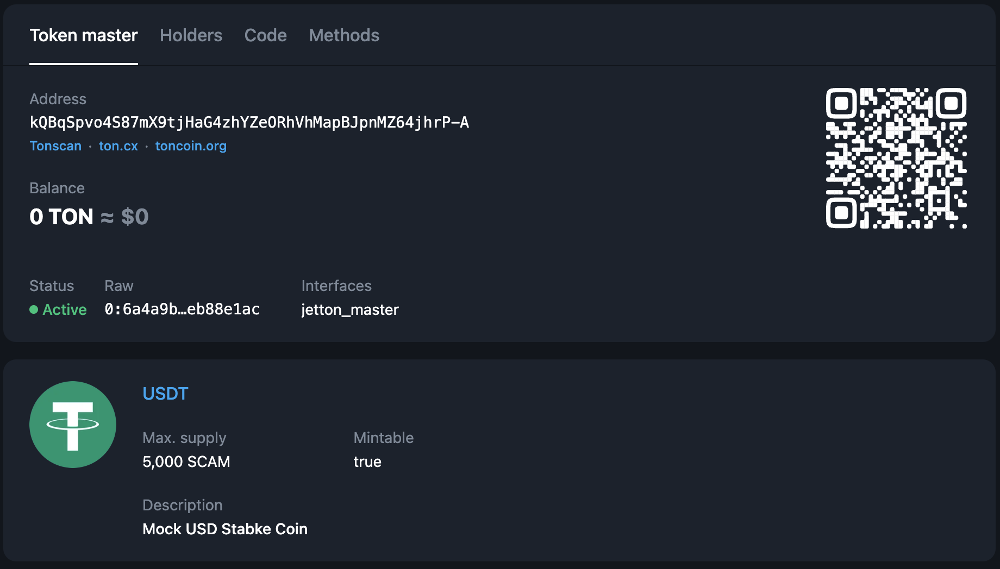
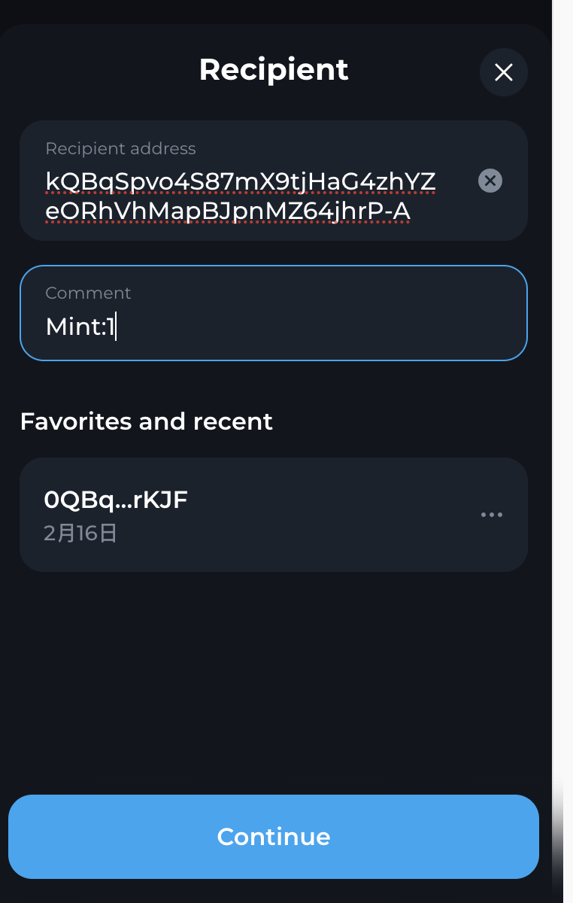
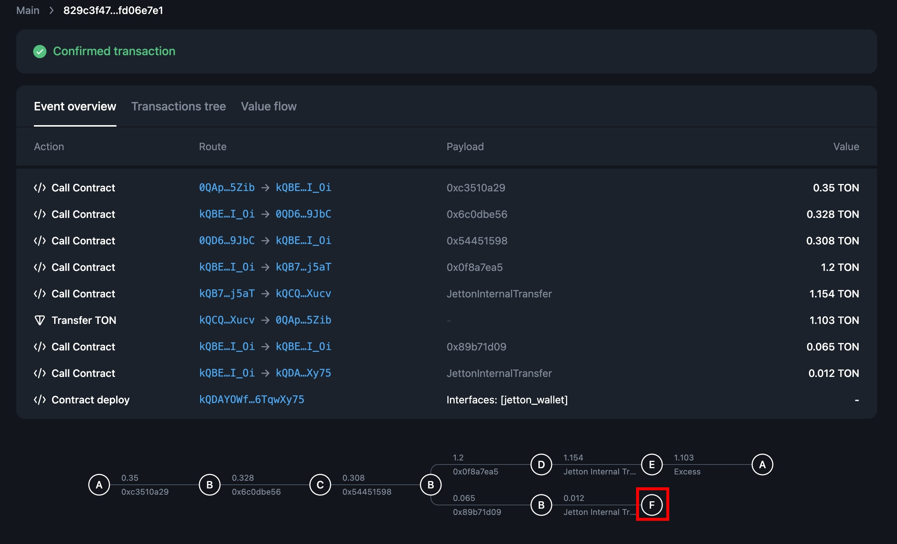
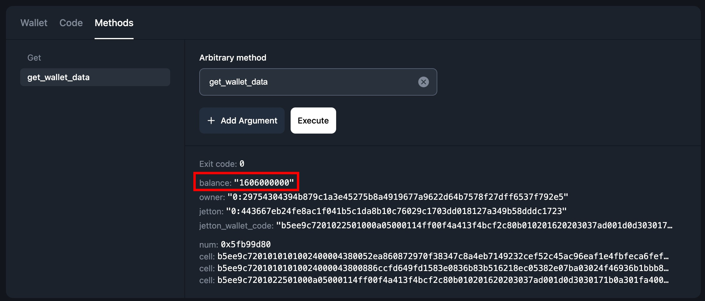

# ticton-playground
This repo is primarily for the **TICTON quote testing event tutorial**. Everyone can refer to this doc to complete the quote and claim rewards. 
Those who successfully follow the tutorial can obtain a TICTON-exclusive NFT. In the future, holders of these NFTs will have priority in participating in airdrops and other events.

If you have any questions, feel free to join our [community](https://t.me/TictonOfficial) and discuss with us.

The following steps will be conducted on TON's testnet!

1. **How to Install**
    
    First, ensure your Python environment meets the version requirements: `Python version >= 3.10 and < 3.12`. The first step is to git clone this repo, then to install the ticton package, please execute the following command in your terminal:
    
    ```bash
    git clone https://github.com/Ton-Dynasty/ticton-playground.git
    cd ticton-playground
    pip install ticton
    ```
    
2. **Mining Testnet USDT**
    
    Next, we will simulate the quotation process for the TON/USDT token pair on the testnet. Ensure you have sufficient funds for the operation. 
    
    - If your TON balance is low, you can obtain additional TON from the [@testgiver_ton_bot](https://t.me/testgiver_ton_bot) on Telegram.
    - You can visit [tonviewer-USDT](https://testnet.tonviewer.com/EQBqSpvo4S87mX9tjHaG4zhYZeORhVhMapBJpnMZ64jhrEQK) , scan the QR code, and use "Mint:1" as a comment to receive 1000 our mock USDT tokens for your testnet operations.(Simply pay 0.1 ton as a transaction fee when submitting "Mint:1" as a comment.)
  
        
        
3. (Optional) Setting the Environment Variables
    
    We requires several environment variables for its operation.You can set the environment variables using the `export` command in your shell. Here are the variables you need to set:
    
    - `TICTON_WALLET_MNEMONICS`: A space-separated list of mnemonics used for wallet authentication and operations.
    - `TICTON_WALLET_VERSION`: Specifies the wallet version. Supported values are "v2r1", "v2r2", "v3r1", "v3r2", "v4r1", "v4r2", "hv2". The default is "v4r2".
    - `TICTON_ORACLE_ADDRESS`: The address of the oracle smart contract on the TON blockchain.
    - `TICTON_TONCENTER_API_KEY`: An API key for accessing TON blockchain data. You can apply for an API key at [@tonapibot](https://t.me/tonapibot).
    - `TICTON_THRESHOLD_PRICE`: A float value that sets a threshold price, with a default of 0.7.
    
    ```bash
    export TICTON_WALLET_MNEMONICS="word1 word2 word3 ... wordN"
    export TICTON_WALLET_VERSION="v4r2"
    export TICTON_ORACLE_ADDRESS="EQBENmfrJP6KwfBBtcHaixDHYCnBcD3QGBJ6NJtY3dwXI0go"
    export TICTON_TONCENTER_API_KEY="your_api_key"
    export TICTON_THRESHOLD_PRICE=0.7
    ```
    
4. Initialization
Initialization: If you have already set the environment variables using the export command, you can easily initialize the ticton client using the following code. You can see examples in `tick.py` or `ring.py`:
    
    ```python
    from ticton import TicTonAsyncClient
    
    client = await TicTonAsyncClient.init()
    
    ```
    
    Alternatively, if you prefer not to set global environment variables, you can pass these directly to the initialization function:
    
    ```python
    from ticton import TicTonAsyncClient
    
    client = await TicTonAsyncClient.init(
        mnemonics="word1 word2 word3 ... wordN",
        wallet_version="v4r2",
        oracle_addr="EQBENmfrJP6KwfBBtcHaixDHYCnBcD3QGBJ6NJtY3dwXI0go",
        toncenter_api_key="your_api_key",
        threshold_price=0.7
    )

    ```
    
1. **Checking the Current TON/USDT Price**
    
    To find the current market price of TON/USDT, you can visit the official website ([https://ton.tg](https://ton.tg/)) or consult other exchanges. This will provide you with the latest pricing information necessary for informed trading or minting decisions on the testnet.
    
2. **Tick**
    
    If you believe the current market price of TON/USDT to be 2.2, you can enter the price in `tick.py` and execute the following command to place a quote:
    ```bash
    python tick.py
    # Success message
    Tick Success, quote price: 2.2, spend base asset: 1.23, spend quote asset: 2.2
    ```
    
    Receiving a success message indicates a successful operation. Wait a few seconds, then you can search your wallet address on [tonviewer](https://testnet.tonviewer.com/) to check the transaction.
    
3. **Getting Alarm Metadata**
    
    After completing the tick operation, an alarm contract will be deployed by the oracle. This contract allows you to view the alarm's metadata. The following steps use tonviewer for demonstration:
    
    1. View the transaction you just ticked.
    2. In the illustration below, **`E`** represents your alarm contract.
        
        

        
    3. By calling **`getAlarmMetadata`** on the alarm contract, you can retrieve the alarm index.
        
        

        
4. **Ring**
    
        
    After calling Tick, you can observe the price of TON. When you believe your quote has deviated from the current price of TON, you can call Ring to close this position to avoid being arbitraged by Timekeeper. 
    
    When calling Ring, if the quote has existed for at least one minute and hasn't been arbitraged by Timekeeper, a reward can be claimed; otherwise, no reward is available.
    
    To complete the Ring process, you can execute the following command to ring:
    
    ```bash
    python ring.py
    # success message
    Ring Success, alarm id: 1
    ```
    
    Receiving a success message indicates a successful operation. Wait a few seconds, then you can search your wallet address on [tonviewer](https://testnet.tonviewer.com/) to check the transaction.
    
    
    Subsequently, you can check the jetton wallet of the TIC token to confirm whether you have received TIC tokens as a reward. 
    
    The address of your TIC wallet is the point **`F`** in the diagram below. You can go to this address, click on Methods, and enter get_wallet_data to view the TIC Balance.

    
    
    
5. **Wind (Advanced, this quote test event can be completed without Wind to receive an NFT)**
   
    If you find that the quote of an Alarm (which can be seen through the get method: `getAlarmMetadata()` and its `baseAssetPrice`) is no longer accurate, then you can arbitrage this Alarm. For detailed arbitrage mechanisms, refer to this [video](https://www.youtube.com/watch?v=_EwAkiGiw-U) or the [TICTON documentation](https://ton-dynasty.github.io/ticton-doc/).

    In simple terms, if you discover Alarm 0 quoting TON at 1 ton = 20u, but you believe 1 ton = 25u, then you can directly spend 20u to buy 1 ton from Alarm 0. For you, this means earning a difference of 5u. Besides arbitraging, you also need to provide a correct quote and offer twice the base asset compared to Alarm 0. Therefore, you need to pay 2 tons and 50u (1 ton = 25u).

    For the wind operation, you can refer to `wind.py`:
    ```bash
    python wind.py
    ```